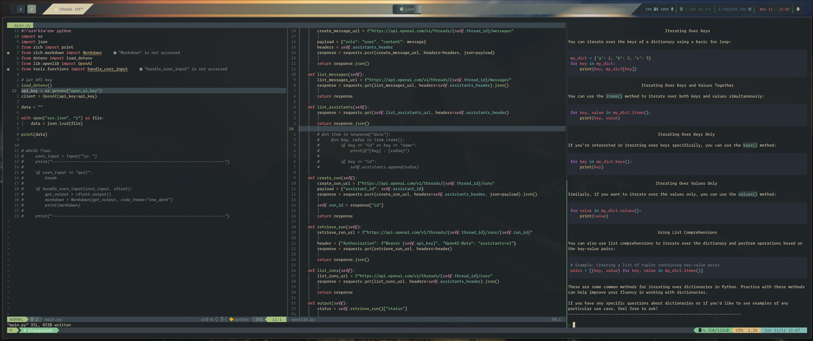

## GPT Term

---

Bring OpenAIs GPT assistants to your terminal.



#### Requirements:

---

1. You'll need an OpenAI API key [Website](https://openai.com)
2. Brave Search API key [Website](https://brave.com/search/api). They provide a free tier that gives 2000 requests a month.
3. An initial assistants ID. You can create an assistant from the OpenAI website. You'll find the ID in the assistant creation section.
4. In order to use the web search function, you'll need to enable function calling on your assistant by clicking add function and copy/paste
   the following into the function box on the website.

```json
{
    "name": "web_search",
    "description": "Search the web for answers.",
    "parameters": {
        "type": "object",
        "properties": {
            "query": {
                "type": "string",
                "description": "Your search query"
            }
        },
        "required": ["query"]
    }
}
```

#### .env

Create a .env with the following inside of it. The .env will need to be in the same folder as main.py

```
brave_api=your_brave_api_key
open_ai_key=your_open_ai_key
assistant_id=your_assistant_id
```

Variables must match, or rename in the main.py file to match your .env

```python
# Main.py
api_key = os.getenv("open_ai_key")
brave_api = os.getenv("brave_api")
assistant_id = os.getenv("assistant_id")
```

#### Dependencies:

-   rich
-   requests
-   BeautifulSoup4
-   python-dotenv

> If you have these installed through your systems package manager you can skip the virutal env.

#### Setting up Virtualenv:

---

Inside the the folder where main.py is create a virtual environment

```bash
virtualenv env
```

```bash
source env/bin/activate
```

Next use pip install to install the requirements.

```bash
pip install -r requirements.txt
```

To run:

```bash
python main.py
```

> I actually setup an alias in my .zshrc file called gpt that runs python /path/to/main.py so I can use it anywhere

#### How to use:

---

To see a list of commands in the program type any of the following: `?, help, show options, options`

| Command               | Description                                                              |
| --------------------- | ------------------------------------------------------------------------ |
| clear                 | Clears the screen.                                                       |
| change assistant (ca) | Change the assistant.                                                    |
| send code (sc)        | Inject a file into the conversation.                                     |
| debug                 | Enables debug mode                                                       |
| save                  | Saves the conversation to a file. Saving as a .md works well.            |
| new thread (nt)       | Creates a new thread. So basically a new conversation.                   |
| save thread (st)      | Saves current thread to threads.json, allows reloading previous threads. |
| load threads (lt)     | Load a previous thread                                                   |
| quit (q)              | Quits the program.                                                       |
